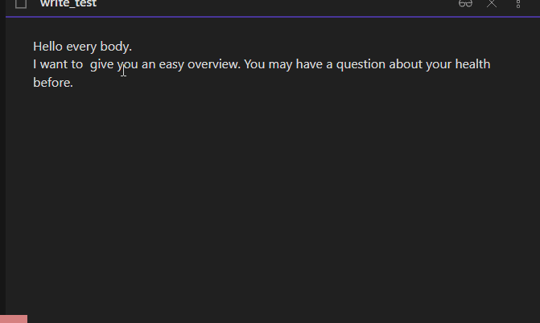
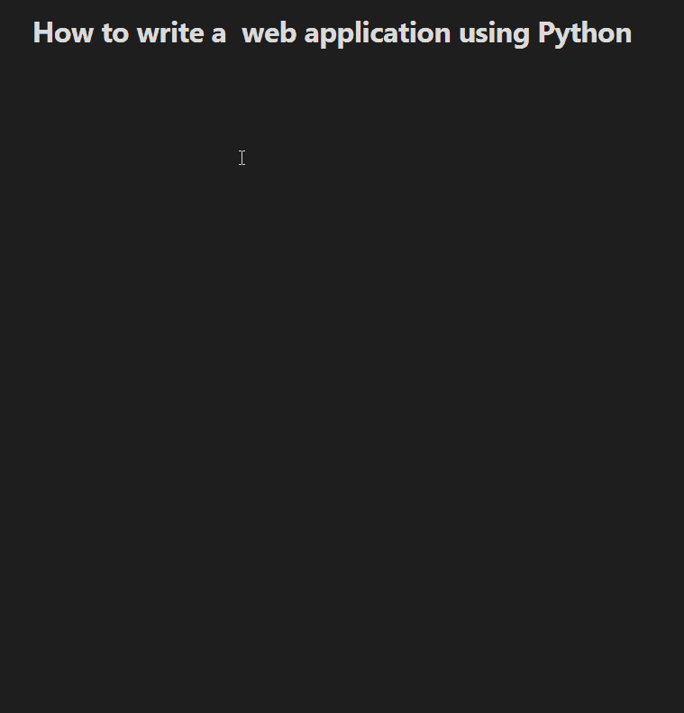
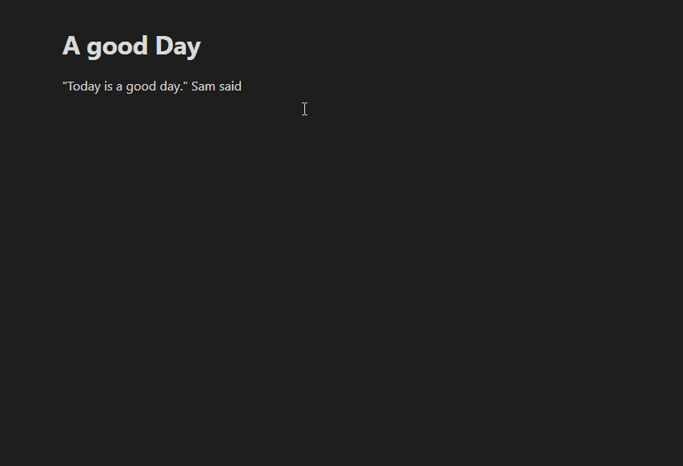
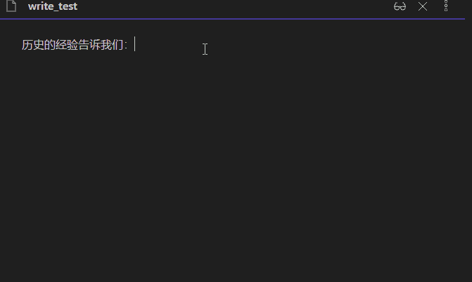

# SenGenerPlugin for obsidian    [中文](readme_CN.md)

This plugin is used to generate a serial of Sentenses for writting. 










## Thanks
Sengener based on obsidian-completr. I copied lots of code from it.
https://github.com/tth05/obsidian-completr

## How to use this plugin

1. download and install obsidian. Create a vault and specify the path. 

2. goto the vault folder. download from releases , and extract them to the plugin folder,
   the path like:   VAULT/.obsidian/plugins/obsidian-sengener.
   
3. Open setting, enable community plugins, then set you options, enable SenSener and configure hot-keys. The default shortcut key is ctrl+`quotation`.

4. You can also select different authoring models and adjust other parameters.

5. Create a document and start writing. Enjoy it. And contact me: zazaji@sina.com.

## Parameter
- API address: service address : Fill in your own API address. I built an example service, which includes English model, dialogue model（Chinese）, work report model（Chinese） and Tencent welm model（Chinese and few English suport）. Sample address: https://fwzd.myfawu.com 
- Type: You can select different authoring models.
- Token: the token used to log in to Tencent welm. You can apply by yourself on Tencent welm official website.
- Enable searching: Whether to enable full-text retrieval. Currently, it provides full-text retrieval for the report model.
- Number of choices: How many candidates. Don’t choose too many, which will affect the speed.
- Max length: the number of words produced at a time. Don’t choose too many, which will affect the speed.

## build your data service

- I build the API service with GPT2. You can also use GPT2 to generate Sentenses directly , or Another one.
- You can build your API service for generating Sentenses. Or you can use the sample service, just for test.
- The example provides english model and chinese model, and  Full-text search . If you want use Another language , you can train your language generation service.
- Data service contain text-generator and full-text-search. The new repo will will be on soon.


- You can build a API service like : 
Post Json: 

```Json
{
	"context": "Yes, We ",
	"token": "Your_token",
	"article_type": "english",
	"max_length": 10,
	"number": 3,
	"is_index": true
}
```

Response Json: 
```Json

{
	"ref": [{
		"content": "...",
		"title": "Nothing"
	}],
	"sentenses": [{
		"value": ", the people of the United States, stand together"
	}, {
		"value": " to say, this is the best deal we've"
	}, {
		"value": " can't say anything, but it's not our"
	}]
}
```
